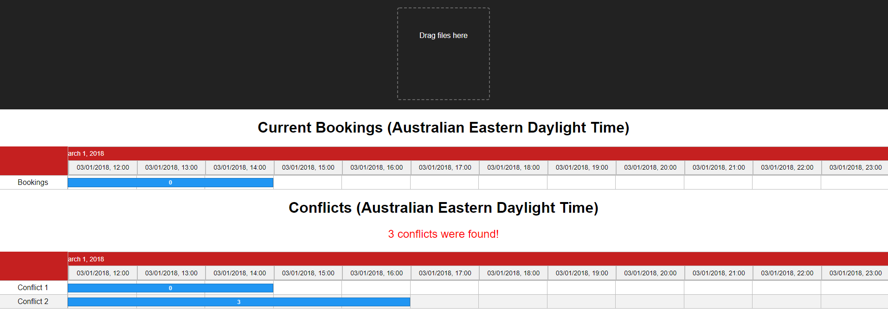

# booking-uploader

This project gives the user the ability to visualise bookings and upload new bookings. Once a new booking is uploaded the client app checks if there are any conflicts. If any conflicts were to be found then the app will display those conflict in a timeline as well.

The application uses the following technologies:
The application uses the following technologies:
- Backend: NodeJs with an ExpressJs server
- Frontend: ReactJs 



## Getting Started

Install Dependencies
```bash
npm install
```
Start the Server
```bash
node ./server/index.js
```
Run the client app
```bash
npm start
```

By default the server runs on port `3001`.

There are three routes:
```
- http://localhost:3001/bookings   - accepts GET requests for retrieving all the bookings
- http://localhost:3001/bookings   - accepts POST requests with an array of bookings. The response is an array of all the bookings stored in the                                         server.S
```

By default the server runs on port `3000`.